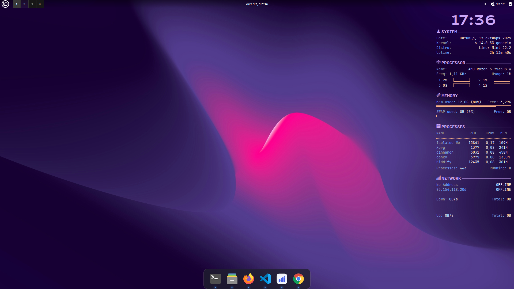

 

 

<h1 align="center">Привет, Меня зовут Иван!</h1>

###

  

<h2 align="center">Технологии</h2>

<h3 align="center">Backend</h3>

  

    

    

    

  

  

  

<h3 align="center">Frontend</h3>

  

  

  

  

  

<h3 align="center">CMS</h3>

  

  

<h3 align="center">Data bases</h3>

  

<h3 align="center">Setup</h3>

  

